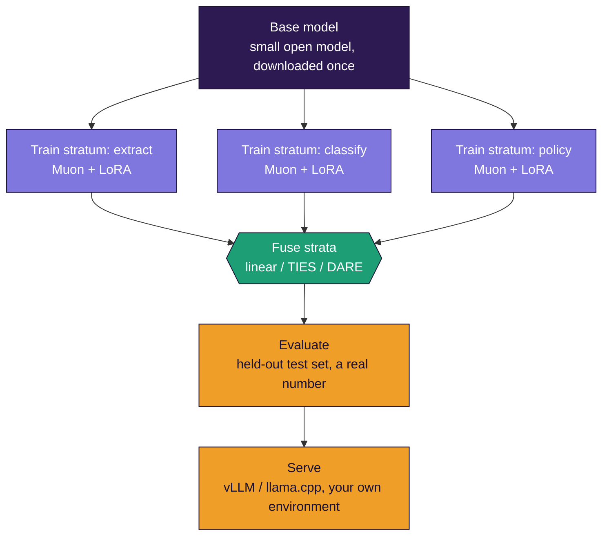

<div align="center">


# STRATUM

### Build industry-specific language models on your laptop - one layer at a time

**S**pecialized **T**raining via **R**eusable **A**dapter **T**iles and **U**nified **M**erging

*Train small skill "strata" independently on commodity hardware, then fuse them into one capable model, leading to industry specific SLM's. No data-center GPUs and No ML PhD needed. Most concepts explained from zero.*

[](LICENSE)
[](pyproject.toml)

</div>

---

## What this is

Most guides to building a custom language model assume a rack of expensive GPUs and a machine-learning background. STRATUM assumes neither. You take a small open model, teach it individual skills **one at a time** on a normal laptop, and **fuse those skills** into one model - like building rock from sediment layers, or a picture from tiles. Each layer (a *stratum*) is cheap to make and can be made in isolation, which is exactly what makes this work on modest hardware. The [documentation](docs/) explains every concept from zero, so you finish not just able to run it, but understanding *why* it works - and able to scale it to production for real industry use.

## Who it's for

- You have a laptop with a consumer GPU (8 GB VRAM is plenty) or a patient CPU.
- You want a model good at *your* specific tasks - extraction, classification, domain Q&A - not a general chatbot.
- You've never trained a model, or you have and want the merge-based approach.
- You want to become an expert, not copy commands blindly.

**Coming from Java, C++, C#/.NET, or backend Python and new to all of this?** Start with [doc 12 - a map from every concept here to patterns you already know](docs/12-for-experienced-developers.md) (adapters as plugins, merging as patch composition, distillation as caching a senior's expertise). It gives you the vocabulary to build *and* explain this to your team and clients.

## The core techniques

STRATUM rests on a few techniques. Understand these and you understand the project. Each is demonstrated with runnable numbers in [`scripts/demo_concepts.py`](scripts/demo_concepts.py) - no GPU needed.

1. **LoRA (adapters)** - freeze the model, train a tiny add-on (under 1% of its size). That add-on fits on a laptop. -> [doc 3](docs/03-lora-and-adapters.md)
2. **Merging** - adapters are *additive*, so skills trained separately combine by (weighted) addition. Build in pieces, fuse at the end. -> [doc 5](docs/05-merging.md)
3. **Muon** - a newer optimizer that keeps half the memory of AdamW and reaches quality in fewer steps, by balancing every training update. -> [doc 4](docs/04-muon-explained.md)
4. **Distillation** - teach your small model to imitate a big "teacher" model, so it captures the teacher's skill at a fraction of the size. Two flavors: the teacher writes your training data, or the student directly matches the teacher's probability distribution. -> [doc 7](docs/07-distillation.md)

## Quick start

```bash
# install
git clone https://github.com/sarkar4777/stratum.git && cd stratum
pip install -e .
pip install bitsandbytes # for 4-bit / QLoRA on NVIDIA GPUs

# understand it first (no GPU, ~20s)
python scripts/demo_concepts.py

# check your hardware
stratum doctor

# train two skill strata (one at a time, on your laptop)
stratum train --skill examples/extract.jsonl --out strata/extract --base Qwen/Qwen3-1.7B
stratum train --skill examples/classify.jsonl --out strata/classify --base Qwen/Qwen3-1.7B

# fuse them into one model
stratum merge strata/extract strata/classify --out models/my-slm

# measure and use (one test set per skill, each with its matching scorer)
stratum eval models/my-slm --test examples/test-extract.jsonl --scorer json_field
stratum eval models/my-slm --test examples/test-classify.jsonl --scorer exact
stratum chat models/my-slm
```

Or run the entire build from one recipe:

```bash
stratum stack examples/recipe.yaml
```

## What the pipeline looks like



Each stratum is trained on its own, one at a time, so you never hold more than one small tile in memory. They fuse into a single model at the end.

## Documentation - a short book, read in order

| # | Doc | You'll understand |
|---|-----|-------------------|
| 0 | [What is a language model?](docs/00-what-is-a-language-model.md) | Tokens, parameters, training - from zero |
| 1 | [The memory problem](docs/01-the-memory-problem.md) | Why laptops struggle, with real numbers |
| 2 | [The STRATUM idea](docs/02-the-stratum-idea.md) | Why build in independent layers |
| 3 | [LoRA and adapters](docs/03-lora-and-adapters.md) | Training 1% of a model, and rank |
| 4 | [Muon, explained fully](docs/04-muon-explained.md) | Why Muon beats AdamW here |
| 5 | [Merging strata](docs/05-merging.md) | The fuse math, 3 methods, honest limits |
| 6 | [Training internals](docs/06-training.md) | The loss mask and every default |
| 7 | [Distillation](docs/07-distillation.md) | Teaching a small model from a big one |
| 8 | [Evaluation](docs/08-evaluation.md) | Proving it works, not guessing |
| 9 | [Full walkthrough](docs/09-full-walkthrough.md) | Empty folder to working model |
| 10 | [Scaling & production](docs/10-scaling-and-production.md) | Bigger models, serving, industry patterns |
| 11 | [Glossary](docs/11-glossary.md) | Every term, full form, plain definition |
| 12 | [For experienced developers](docs/12-for-experienced-developers.md) | Every concept mapped to patterns you know |
| 13 | [Troubleshooting](docs/13-troubleshooting.md) | The problems people actually hit, with fixes |

## Built for industry-specific models

STRATUM suits real domain deployments because a production model usually needs several distinct skills, and modeling each as a stratum gives you:

- **Data residency** - train and serve entirely in the client's environment - nothing leaves.
- **Auditability** - each stratum's `stratum_card.json` records what was trained on what, with what settings.
- **Incremental change** - a rule changes, retrain one stratum and re-fuse. No full retrain.
- **Reuse** - a stratum built for one client drops into the next, given a shared base.
- **Cost** - one small serving GPU forever, plus a few tens of dollars of training burst per build.

[Doc 10](docs/10-scaling-and-production.md) covers the full production loop.

## What STRATUM is *not*

- **Not a general-knowledge model.** It's excellent at the specific skills you train in, not at being a universal genius. That's the point.
- **Not instant.** On a laptop, one stratum is minutes to a couple of hours. A "start it before lunch" workflow.
- **Not magic merging.** Strata from different bases, or deeply conflicting skills, won't fuse cleanly - [doc 5](docs/05-merging.md) is honest about the limits.
- **Not a substitute for good data.** The biggest quality lever is the quality of your skill examples.

## Verify it yourself

```bash
python scripts/demo_concepts.py # the core ideas, real numbers, no GPU
python -m pytest tests/ -v # unit tests plus a full pipeline run on a tiny model
stratum doctor # checks your GPU and Hugging Face readiness
```

Every code path in this repo - the optimizer math, delta extraction, all three
merge methods, the loss mask, the scorers, and the distillation loss - is covered
by the test suite. The pipeline test builds a tiny model from scratch, trains two
strata on it, merges them with every method, checks the merged weights are exactly
base plus deltas, and evaluates the result - on CPU, in seconds. The same suite
runs in CI on every push.

## Acknowledgements

STRATUM assembles published research and open tooling into one teachable pipeline.
The credit for the underlying methods belongs to their authors:

- **LoRA** - Hu et al., "LoRA: Low-Rank Adaptation of Large Language Models" (2021)
- **QLoRA** - Dettmers et al., "QLoRA: Efficient Finetuning of Quantized LLMs" (2023)
- **Muon** - Keller Jordan (2024), building on Jeremy Bernstein's work on orthogonalized updates
- **TIES merging** - Yadav et al., "TIES-Merging: Resolving Interference When Merging Models" (2023)
- **DARE** - Yu et al., "Language Models are Super Mario: Absorbing Abilities from Homologous Models" (2023)
- **Distillation** - Hinton, Vinyals and Dean, "Distilling the Knowledge in a Neural Network" (2015)
- **Tooling** - Hugging Face Transformers and PEFT, the bitsandbytes library, PyTorch, and the Qwen team's open models

## License

MIT - use it commercially, modify it, ship it. Contributions welcome - see [CONTRIBUTING.md](CONTRIBUTING.md).

<div align="center">

*Small layers. One model.*

</div>
