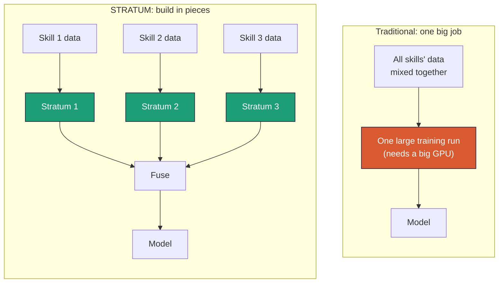

# 2 - The STRATUM idea

*The mental model behind the whole project - why building a model in independent layers is not just a memory trick but a better way to develop specialized models.*

---

## The name

A **stratum** is a layer. **Strata** are layers stacked into something larger - the way sediment builds rock, or the way you'll build a capable model from separate skill layers. STRATUM backronyms to **S**pecialized **T**raining via **R**eusable **A**dapter **T**iles and **U**nified **M**erging. Each stratum is one skill; stacked and fused, they make your model.

## The core move

Traditional fine-tuning teaches a model many skills by throwing all the training data together and running one big job. STRATUM does the opposite:

1. Teach the model **one skill at a time**, each as a tiny separate adapter (a stratum).
2. Each stratum is trained against the **same frozen base model**.
3. **Fuse** the strata into one model by combining their adjustments.

Because you only ever train one small stratum at a time, you never hold more than a tile's worth of training in memory - that's what fits it on a laptop. And because every stratum modifies the same base, they're compatible by construction, so fusing is straightforward math (doc 5).

Here's the contrast in one picture. The traditional way trains everything in one heavy job; the STRATUM way trains small pieces independently and fuses them:

Each stratum on the right is small and trained on its own. If a skill needs fixing, you retrain just that one box, not the whole model.

## Why this is genuinely better, not just cheaper

The piece-by-piece approach earns its keep in four ways that matter for real industry work:

**Incremental growth.** Need a new capability next quarter? Train one new stratum and re-fuse. You don't retouch the skills you already built. Contrast the all-at-once approach, where adding a skill means re-running the whole job.

**Debuggability.** A skill is weak? You know exactly which stratum to retrain - it's a named, separate artifact. In a monolithic fine-tune, a weakness is smeared across one opaque model.

**Reuse across projects.** A well-made stratum - say "extract dates and amounts from contracts" - can drop into a different client's model, as long as they share a base. Your strata become a library of assets.

**Parallel development.** Different people can build different strata at the same time on different machines, with no coordination, because the strata never interact until the fuse step.

## The industry angle

This is why STRATUM suits building **domain-specific** models. A real deployment usually needs several distinct skills - extract these fields, classify these tickets, follow this policy, answer in this format. Modeled as strata, each is a small, testable, reusable unit. You assemble the exact model a client needs from a shelf of strata, swap one out when requirements change, and never retrain from scratch.

## What a stratum actually is

Concretely, a stratum is a folder containing:
- a small adapter weights file (a few megabytes),
- an adapter config (rank, which layers it touches),
- a `stratum_card.json` recording its base model, skill file, training settings, and final loss - its provenance.

That card is what lets STRATUM verify, at fuse time, that all your strata came from the same base and belong together. In a regulated industry, it's also your audit trail: which skill, trained on what, with which settings.

## The honest limit, stated early

Strata that share a base fuse cleanly *when the skills are reasonably independent or complementary*. Skills that deeply conflict (one trained to always be terse, one to always be verbose) won't fuse into a clean single model - you keep those as separate swappable strata instead. Doc 5 covers exactly where fusing works and where it doesn't. Knowing this boundary up front saves you a frustrating weekend.

## What you now know

- A **stratum** is one skill, trained as a small adapter against a shared frozen base.
- Building in strata gives **incremental growth, debuggability, reuse, and parallel work**.
- It's especially suited to **domain-specific** models assembled from a shelf of skills.
- Each stratum carries a **provenance card**; fusing works best for independent/complementary skills.

Next: [LoRA - how a stratum trains under 1% of the model and still teaches real skills ->](03-lora-and-adapters.md)
