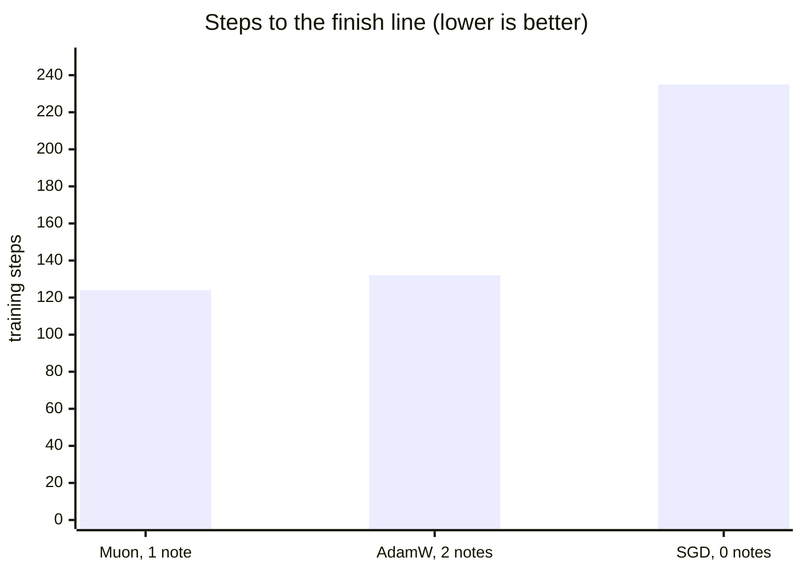

# 4 - Muon, explained fully

*The optimizer STRATUM uses instead of AdamW. The most technical doc, built from scratch - you only need doc 0's four-step loop to follow it. No gaps.*

---

## Recap: what an optimizer does

Training is: predict, measure loss, compute the **gradient** (fix direction per dial), **nudge**. The **optimizer** does the nudging - it turns each dial's gradient *direction* into an actual *step*. The gradient says "up" - it doesn't say "how far." Deciding how far, well, is where cleverness lives.

## The naive approach and its flaw

Simplest optimizer, **SGD** (stochastic gradient descent): `new = old - (small number) x gradient`. Step a little along the gradient. That small number has a name you'll meet everywhere: the **learning rate** - the master knob for how big every step is. Too small and training crawls, too large and the dials lurch past good values and never settle. ("Stochastic" just means each step uses a small random batch of examples rather than the whole dataset, so the gradients are noisy estimates - doc 6 covers batching.)

In code, SGD is one line:

```python
W = W - lr * g          # lr is the learning rate, g the gradient
```

It works but is crude: two dials with very different gradient sizes get scaled by the same `lr`, so one lurches while the other crawls. Training goes lopsided - a few dials dominate every step.

## How AdamW fixes it (and what it costs)

AdamW gives each dial its **own** step size from its history, via two running notes per dial:
- **Momentum** - smoothed average of recent gradients (kills jitter).
- **Variance** - smoothed average of gradient *sizes* (shrinks steps for wild dials, emboldens steady ones).

The whole mechanism is a few lines. This is real, runnable numpy - it's what races in the demo below:

```python
m = 0.9 * m + 0.1 * g            # note 1: momentum, a smoothed gradient
v = 0.999 * v + 0.001 * g * g    # note 2: variance, smoothed gradient size
W = W - lr * m / (np.sqrt(v) + 1e-8)   # each dial: big v, small step
```

(The full version also corrects for the notes starting at zero and adds decoupled weight decay - the "W" in the name - but this is the heart of it.)

Effective, but those **two notes per dial** are the single biggest chunk of training memory (doc 1). Two notes x four billion dials is a lot.

## Muon's different idea: fix the whole grid at once

Here's the real divergence. AdamW treats every dial **individually**. But dials aren't a loose bag - they're organized into **grids** (weight matrices, doc 3). Muon uses that structure. It looks at a grid's entire update and asks a question AdamW can't: *is this update lopsided across directions - are a few directions getting all the movement while others get none?* Then it **rebalances so every direction gets a fair share.** The technical term is **orthogonalization** - experts say Muon "orthogonalizes the momentum."

## Seeing it happen

Any grid update can be described by a set of independent **directions** and how hard it pushes along each (these push-strengths are **singular values** - think "movement per independent direction"). A lopsided update has a few big ones and many near-zero. Real before/after from STRATUM's demo:

```
BEFORE (lopsided - a few directions dominate):
   [4.74 3.35 2.93 1.63 0.93 0.51]
AFTER Muon's rebalancing (flattened toward 1 - every direction shares):
   [1.13 1.12 1.09 0.81 0.75 0.75]
```

Before: pushes 4.74 one way, 0.51 another - 9x imbalance. After: all near 1. Every direction gets a comparable, healthy push. That's the whole idea. A balanced update makes progress on *everything* the grid must learn at once, instead of over-fixing a couple of directions and starving the rest - so you reach good quality in **fewer steps**, which on a slow laptop is time back in your pocket.

Verify it: `python scripts/demo_concepts.py`.

## The one piece of machinery

To flatten those singular values without the slow step of computing them, Muon runs a short **Newton-Schulz iteration** - five matrix multiplications that push all singular values toward 1. It's a deliberate fast approximation. That's the "little extra compute" Muon spends. In return it keeps **one** note per dial (momentum) instead of two, and needs fewer steps. Here's the core, from `stratum/muon.py`, trimmed of its shape handling and safety guards:

```python
def newton_schulz(G, steps=5):
    a, b, c = 3.4445, -4.7750, 2.0315
    X = G.bfloat16() / (G.norm() + 1e-7) # normalize first
    for _ in range(steps):
        A = X @ X.T
        B = b * A + c * (A @ A)
        X = a * X + B @ X # push singular values -> 1
    return X
```

Five matmuls, no SVD. For the small matrices in LoRA strata this is negligible.

## The honest caveats - no gaps

**Muon is for grids, not everything.** Some parameters aren't 2D grids - the vocabulary lookup table (embeddings) and various 1D vectors (biases, layernorm gains). Muon's trick doesn't apply. STRATUM handles this automatically: `split_params_for_muon()` routes 2D transform matrices to Muon and everything else to a small AdamW. You get Muon where it helps and a safe default elsewhere. In code:

```python
muon_params, adamw_params = split_params_for_muon(model)
opts = [Muon(muon_params, lr=2e-2), torch.optim.AdamW(adamw_params, lr=1e-3)]
```

**It's newer than AdamW.** AdamW has a decade of testing everywhere. Muon is newer, though proven in serious large-model training and well-suited to STRATUM's matrix-heavy adapter work. If you ever want the conservative choice, `--optimizer adamw` switches everything to AdamW.

**Credit where due.** Muon was created by Keller Jordan (2024), building on Jeremy Bernstein's work on orthogonalized updates, and the Newton-Schulz coefficients in STRATUM's implementation are the ones Jordan published. STRATUM's version favors clarity and adds the safety guards described above.

**Safety guards.** STRATUM's Muon skips any update that isn't finite (from a bad batch or numerical underflow) rather than letting a NaN poison training - a robustness detail that matters on small datasets. You'll never silently corrupt a run.

## Muon vs AdamW at a glance

| | AdamW | Muon |
|---|---|---|
| Notes per dial | 2 | 1 |
| Treats dials | individually | as grids, rebalanced |
| Extra math/step | little | short Newton-Schulz |
| Steps to good quality | baseline | comparable at small scale, fewer at large |
| Applies to | all params | 2D grids (AdamW for rest) |
| Maturity | very mature | newer, proven at scale |

## Watch them race

Claims are cheap, so the demo races all three optimizers on the same task: teach a small **two-layer network** to imitate a "teacher" network, from noisy minibatches - a miniature of real training. (A network **layer** is one grid of dials followed by a simple squashing function, and layers stack: the output of one feeds the next. Two layers is the smallest network with real depth. Doc 0 covers this.) Every optimizer gets a sweep over learning rates and races at its own best setting, with the same decaying step size, so nobody wins by tuning luck. The finish line: test error down to 5% of its starting value.

From `python scripts/demo_concepts.py`:

```
 optimizer  best lr  steps to finish  notes per dial
      muon     0.03              124               1
     adamw      0.1              132               2
       sgd      0.3              235               0
```



Read it honestly, because this is the part most write-ups fudge:

- **SGD trails badly** - one shared step size for every dial really does cost you.
- **Muon and AdamW arrive together** at this toy size. That's the truth at small scale: both are good optimizers, and you should not expect Muon to demolish AdamW on a laptop-sized problem.
- **Muon does it with half the optimizer memory** - one note per dial against AdamW's two. That advantage holds at every scale, and it's the one doc 1's memory table is built on.
- Muon's **fewer-steps** advantage is a scale phenomenon: it compounds on the big, structured weight grids of real language models (where it was proven), not on toy problems. At STRATUM's scale you get AdamW-class quality for half the optimizer memory - which is exactly why `--optimizer adamw` remains a first-class choice, not a fallback.

## What you now know

- An optimizer turns gradient **direction** into a **step**, and the **learning rate** is the master knob for step size.
- **SGD** is one line and one shared step size - simple, and measurably the slowest of the three in the demo race.
- **AdamW** personalizes each dial's step with **two notes per dial** - effective, memory-heavy, and a handful of lines of code.
- **Muon** rebalances each grid so **every direction shares** (orthogonalization) and keeps **one note**. At laptop scale it matches AdamW's steps with half the optimizer memory, and its step advantage grows with model size.
- It uses a short **Newton-Schulz** routine, applies to **2D grids** (AdamW covers the rest), guards against NaNs, and falls back to AdamW on request.

Next: [fusing strata into one model - the math, the three methods, and the honest limits ->](05-merging.md)
