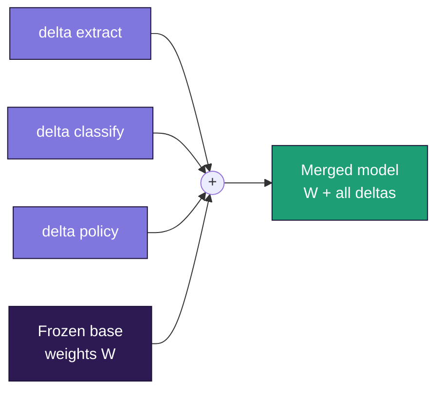

# 5 - Merging: fusing strata into one model

*The idea STRATUM is named for. The math of why it works, the three methods and when to use each, the code, and - honestly - where it breaks.*

---

## The picture

You've trained three strata, each on its own skill, each against the same frozen base:

- `strata/extract` - pulls structured fields from documents
- `strata/classify` - sorts tickets into categories
- `strata/policy` - answers following your compliance rules

Each is a small folder. Now you want one model doing all three. That's **merging** (fusing).



Each stratum contributes a small delta; merging adds them all onto the same frozen base. The whole operation is addition, which is why it's cheap and why the pieces compose.

## Why it works - the math

From doc 3, a stratum's effect is **added** to the model: `W + delta`, where `delta = scaling x (B @ A)`. Addition composes - you can add several:

```
one skill: W + delta_extract
all skills: W + delta_extract + delta_classify + delta_policy
```

That's the entire trick. Every stratum is an additive adjustment to the same `W`, so stacking them is adding them. STRATUM's demo shows the real arithmetic:

```
base weight norm: 0.748
skill-1 delta norm: 0.126
skill-2 delta norm: 0.112
merged weight norm: 0.753 <- base + both skills
```

You built a capable model in pieces, and joining was addition. That's why it fit on a laptop: you never held more than one stratum's training in memory, yet the finished model contains all of them.

## Recovering the delta from a saved stratum

STRATUM stores strata as PEFT adapters (separate `lora_A` and `lora_B` tensors). At merge time it reconstructs each delta. From `stratum/merge.py`:

```python
A = raw["...q_proj.lora_A.weight"] # [r, in]
B = raw["...q_proj.lora_B.weight"] # [out, r]
scaling = lora_alpha / r # classic LoRA scaling
delta = (B @ A) * scaling # [out, in], same shape as the base weight
```

This is verified in the test suite (`test_extract_deltas_math`) to match exactly. Getting the `scaling` right is essential - miss it and every merged skill is silently mis-weighted.

## Weighted merging

Plain addition treats skills as equally important. Usually you want control, so STRATUM uses a **weighted** sum:

```
W + 0.7-delta_extract + 0.5-delta_classify + 0.3-delta_policy
```

Turn a skill up if the merged model is weak at it; down if it's bleeding into others. Default is equal weights; override with `--weights`.

## The three methods, escalating

Weighted addition (linear) is the default and right first choice. When strata conflict, smarter recipes help. STRATUM ships all three.

**1. Linear (weighted sum).** Fast, simple. Best when skills are fairly independent - extraction and classification rarely fight. This is your default.

**2. TIES - resolve conflicts.** When two strata push the *same* dial in *opposite* directions, plain addition lets them cancel and both skills suffer. TIES keeps each stratum's most important adjustments, then for each dial lets the majority sign win instead of averaging to mush. Use when linear makes several skills mediocre at once - the signature of conflict. Tune with `--density` (fraction of each stratum kept, default 0.2).

**3. DARE - reduce interference.** DARE randomly drops most of each stratum's small adjustments and rescales the survivors. Sounds destructive; isn't - most tiny adjustments are redundant, and dropping them cuts crosstalk between strata. Best when fusing *many* strata. Often combined with TIES. Tune with `--drop` (fraction dropped, default 0.9).

```bash
stratum merge strata/extract strata/classify --out models/m --method linear
stratum merge strata/extract strata/classify --out models/m --method ties --density 0.3
stratum merge strata/*/ --out models/m --method dare --drop 0.9
```

You don't memorize these - you escalate: linear, check eval; if skills degrade, TIES; if many strata clash, DARE.

## Where merging fails - the honest part

**Different bases don't merge.** A stratum is tuned to *its* base's specific dials. Add it to a different base and it's nonsense. STRATUM records each stratum's base in `stratum_card.json` and **refuses** to merge mismatched ones. All strata you fuse must share one base.

**Deeply conflicting skills won't co-exist.** One stratum trained to always be terse and one to always be verbose fuse into a muddled compromise. The fix isn't a better algorithm - it's recognizing they shouldn't be one model. Keep them as separate strata and load whichever you need.

**Too many strata dilute.** 3-5 fuse cleanly; 20 and each signal goes faint. For many skills, group related ones, or keep some as swappable separate strata rather than fusing everything.

**No emergent skills.** The merged model does the *union* of what its strata taught - nothing new appears from combination. Obvious, but worth stating so expectations are right.

## The code path, end to end

`stratum merge` (in `stratum/__main__.py`):
1. Read each stratum's `stratum_card.json`; abort if bases differ.
2. `extract_deltas()` on each stratum -> `{weight_name: delta}`.
3. `merge(method, deltas, weights)` -> combined deltas.
4. Load a fresh copy of the base, add each delta onto the matching weight, save a standalone model plus a `stratum_merge.json` record.

The whole thing is verified in the integration test: train two strata, extract, merge with all three methods, apply, and generate - all pass.

## What you now know

- Merging works because strata are **additive** deltas on the same base: combine by adding.
- The delta is `(B @ A) x (alpha/r)`; getting the **scaling** right is essential.
- **Weighted** merging emphasizes skills; three methods escalate: **linear -> TIES -> DARE**.
- It **fails** on different bases, deeply conflicting skills, or too many strata.

Next: [the training internals - batching, the loss mask, gradient accumulation, and every default explained ->](06-training.md)
