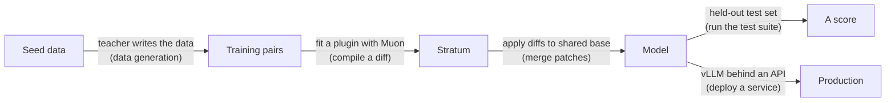

# 12 - For experienced developers: mapping this to what you know

*If you're a strong Java, C#/.NET, Python, or other developer but new to machine learning, this doc translates every core STRATUM concept into ideas you already use daily - and gives you the language to explain it to colleagues and clients with confidence.*

---

## Why this doc exists

You already know how to build systems. What's new here isn't engineering discipline - it's a vocabulary and a mental model. This doc bridges the two so the rest of STRATUM stops feeling foreign. Each section: the ML term, the analogy from ordinary software, and a sentence you could say out loud in a meeting.

## Model = a giant pure function with baked-in constants

**What it is:** A model is a function `f(tokens) -> next-token probabilities`. The "constants" are billions of numbers (parameters) determined by training.

**You already know this as:** A pure function with an enormous lookup/weight table. Like a compiled function whose behavior is entirely fixed by a huge config blob. Inference is just calling the function - it has no side effects and no memory between calls (unless you feed history back in).

**Say it in a meeting:** "The model is a deterministic function, and the weights are its configuration. Training is how we compute that configuration."

## Training = fitting constants by iterative optimization

**What it is:** Repeatedly measure error (loss), compute which direction each constant should move (gradient), and nudge.

**You already know this as:** A feedback loop / control system, or curve-fitting. If you've ever done gradient descent in a numerical library, tuned a PID controller, or even used a solver in Excel, it's the same shape: define an error, minimize it by stepping downhill.

**Say it in a meeting:** "Training is numerical optimization. We define a loss function and descend it. It's fitting, not programming."

## Parameters vs hyperparameters = config values vs build settings

**What it is:** Parameters are learned (the weights). Hyperparameters are choices *you* set before training (rank, learning rate, epochs).

**You already know this as:** Parameters are like compiled output, while hyperparameters are like `build.gradle` / `.csproj` / `pyproject.toml` settings and compiler flags. You choose the flags, and the build produces the artifact.

**Say it in a meeting:** "Rank and learning rate are hyperparameters - build settings. The weights are the build output."

## LoRA / adapter = a plugin or a decorator

**What it is:** Freeze the model, attach a small trainable add-on that adjusts its behavior for one skill.

**You already know this as:** The **decorator pattern** or a **plugin**. The core class is sealed, so you wrap it with a small extension that modifies behavior without touching the original. Or think dependency injection: the base is fixed, you inject a small specialized component. In web terms, it's like a middleware layer that adjusts requests/responses without rewriting the server.

**Say it in a meeting:** "An adapter is a plugin for the model. We don't fork the base - we ship a small extension that composes with it."

## Rank = the capacity/precision dial on that plugin

**What it is:** How complex an adjustment the adapter can represent. Too low and it can't capture the skill.

**You already know this as:** A buffer size or precision setting. Set it too small and data doesn't fit - you get truncation/plateau, not a crash. There's a minimum viable size for the job.

**Say it in a meeting:** "Rank is the adapter's capacity. Undersize it and the skill won't fit - it plateaus, silently."

## Merging strata = composing modules / applying patches

**What it is:** Each stratum is an additive change to the same base, combined by (weighted) addition.

**You already know this as:** **Git patches / diffs applied to the same base commit.** Each stratum is a diff against the same base model, and merging is applying several diffs. Just like Git, diffs against *different* bases don't apply cleanly, and conflicting diffs need a resolution strategy (that's what TIES/DARE are - merge conflict resolvers). It's also like composing pure functions or mixing in traits.

**Say it in a meeting:** "Strata are diffs against a shared base. Merging is applying the diffs, and TIES and DARE are our conflict-resolution strategies."

## The optimizer (Muon/AdamW) = the update strategy

**What it is:** The algorithm that turns gradients into actual weight updates.

**You already know this as:** A scheduling or step-size policy. Like choosing an exponential-backoff strategy vs a fixed retry interval - same goal (converge), different rule for how big each step is and how much history to keep. AdamW keeps two running averages per parameter, while Muon keeps one and rebalances per matrix.

**Say it in a meeting:** "The optimizer is our update policy. Muon keeps less state and takes better-conditioned steps, so we converge in fewer iterations."

## Quantization = lossy compression of the weights

**What it is:** Store weights in 4 bits instead of 16 to save memory, at a small quality cost.

**You already know this as:** Lossy compression, like JPEG for images or reducing a `double` to a `float` (or `int8`). You accept a little imprecision for a big memory/bandwidth win. Since the base weights are read-only during our training, compressing them is nearly free.

**Say it in a meeting:** "Quantization is lossy compression for weights - like int8 instead of float32. Read-only weights compress cheaply."

## Distillation = a senior engineer training a junior

**What it is:** A big teacher model transfers its skill to a small student model.

**You already know this as:** Knowledge transfer / pair programming / code review. The senior (teacher) doesn't just give the answer - they convey judgment and confidence. Or in caching terms: the teacher is an expensive service, and you're training a cheap local cache/approximation of it for a specific set of queries.

**Say it in a meeting:** "Distillation is training a cheap local model to approximate an expensive one on our specific tasks. We're caching the teacher's expertise into a small deployable."

## Loss mask = which fields count in a diff/assertion

**What it is:** Compute loss only on the response tokens, not the prompt.

**You already know this as:** Selective assertion or a partial diff - you only compare the fields that matter and ignore boilerplate. Getting it wrong is like asserting on the whole response object including the request echo: your test "passes" for the wrong reason and quality silently rots.

**Say it in a meeting:** "The loss mask scopes training to the output, like asserting only on the fields that matter."

## The corpus pipeline = an ETL job

**What it is:** `stratum corpus` extracts text from real documents, deduplicates, chunks, and has a teacher generate training pairs (doc 14).

**You already know this as:** Extract, transform, load. Same discipline too: idempotent re-runs (content-hash caching), per-record error isolation (one corrupt file doesn't kill the batch), and a manifest you can audit. If you've built a data pipeline, you've built this.

**Say it in a meeting:** "The corpus step is an ETL job with caching and provenance. Re-runs are incremental and failures are per-file."

## RAG vs fine-tuning = runtime lookup vs compiled-in constants

**What it is:** Retrieval fetches document passages at question time. Fine-tuning bakes behavior into the weights.

**You already know this as:** Reading config from the database at request time versus hard-coding values at compile time. You'd never recompile to change a price, and you'd never do a database round-trip for string-formatting logic. Facts change and need sources - look them up (RAG). Behavior is stable and needs speed - compile it in (fine-tune).

**Say it in a meeting:** "Retrieval is the runtime lookup for facts, the fine-tuned model is the compiled behavior. We need both, and doc 14 is where we draw the line."

## Evaluation = your test suite, with a held-out set

**What it is:** Score the model on data it never trained on.

**You already know this as:** Unit/integration tests, plus the cardinal rule of not testing on your training data - which is exactly **not writing a test that asserts the code you copied to write the test**. The held-out set is your honest test suite, and training data is the code under test.

**Say it in a meeting:** "Eval is our test suite. Testing on training data is like grading the exam with the answer key mixed in - meaningless."

## Serving = deploying any stateless service

**What it is:** Run the finished model behind an API.

**You already know this as:** Deploying a stateless microservice. It has a warm-up (model load), a memory footprint, throughput/latency tradeoffs, and benefits from batching - all the ops concerns you already manage. Tools like vLLM are the equivalent of a tuned application server.

**Say it in a meeting:** "Serving a model is deploying a stateless service with a big warm cache. Standard ops apply."

## The whole STRATUM pipeline in your terms

Each arrow's label gives the machine-learning step and, in parentheses, the software-engineering equivalent you already know. Nothing here is outside your competence.

Nothing here is outside your competence. It's optimization + the decorator pattern + patch composition + a test suite + a stateless deploy. The only genuinely new part is the intuition for *why* the math works - and docs 0-8 give you exactly that.

## You can now hold the conversation

After the docs plus this map, you can accurately say all of the following, and defend each:

- "We build a specialized model by fitting small adapter plugins and composing them like patches against a shared base."
- "We use Muon because it keeps less optimizer state and converges in fewer steps than AdamW for our matrix-heavy adapter training."
- "Rank is the capacity knob, and we size it to the skill's complexity."
- "We distill from a larger teacher to get small-model economics with near-teacher quality on our tasks."
- "Merging is diff composition, and TIES and DARE are conflict resolution for when strata disagree."
- "We evaluate on a held-out set with a task-appropriate scorer, and we gate deployment on it in CI."
- "Everything runs in the client's environment, so data never leaves and every stratum is auditable."

That's fluency. Go build.
