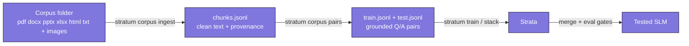

# 14 - From a corpus to a model

*The enterprise scenario: an organization has thousands of documents - PDFs, Word files, slide decks, spreadsheets, web pages, images - and wants "an SLM built from all of this." This doc is the straight answer to that request: what a model can actually learn from a corpus, what belongs in retrieval instead, and the pipeline that takes a raw folder to a trained, tested model.*

---

## First, the honest sentence that saves the project

**Fine-tuning is not memory.** Training a model on your documents teaches it *behaviors* reliably - your terminology, your formats, how to extract, classify, and answer in your domain's voice. It teaches *facts* unreliably: a model fine-tuned on ten thousand pages will still misremember clause numbers, blend similar documents together, and confidently state things that were true in the 2019 revision. And it cannot cite its source or pick up last week's amendment without retraining.

So "make the model know our documents" decomposes into two different jobs:

| The job | The right tool | Why |
|---|---|---|
| Answer questions using exact document content, with sources, always current | **Retrieval (RAG)** | Looks the passage up at question time - exact, citable, updates when documents do |
| Speak the domain's language, extract its fields, classify its records, follow its formats and policies | **Fine-tuned skills - STRATUM strata** | Behaviors live in the weights and don't need lookup |

**RAG** (retrieval-augmented generation) means: store the documents in a search index, and when a question comes in, find the most relevant passages and paste them into the model's prompt so it answers from what is in front of it. The model provides comprehension and language - the index provides the facts. STRATUM does not ship a retrieval stack (any standard one works, running in your environment), but the model STRATUM builds is exactly the model you want behind one: small, cheap to serve, and trained to handle *your* documents' style of content.

The architecture that wins this engagement is therefore **both**: a retrieval layer for knowledge, and a STRATUM-built SLM for skills - trained, as it happens, from the same corpus. The rest of this doc is the pipeline that does the second part.

## The pipeline at a glance



Everything from `train` onward is the pipeline you already know (docs 6, 5, 8). The two `corpus` commands are the front end, and they are built for corpora in the thousands of files: every expensive step is cached and resumable, a corrupt file is recorded and skipped rather than fatal, and every chunk carries provenance back to its source file and position.

## Step 1 - ingest: the folder becomes clean text

```bash
pip install 'stratum-slm[corpus]'   # pdf, docx, pptx, xlsx, image support

stratum corpus ingest --in /data/company-docs --out corpus/ --redact
```

What happens, in order, for every file in the folder tree:

- **Extraction.** Text comes out of PDF, Word, PowerPoint (slides, tables, speaker notes), Excel (all sheets), HTML (scripts and styles stripped), and plain text and Markdown. This step is often called **document parsing** or, for scanned images of text, **OCR** (optical character recognition - software that reads pictures of text). A scanned PDF with no text layer gets a clear error telling you to route it through the image path below.
- **Deduplication.** Files are fingerprinted by content (SHA-256). The same document saved under five names is ingested once - real corpora are full of copies, and duplicates would both waste teacher calls and skew training.
- **Redaction** (with `--redact`). A baseline scrub replaces emails, phone numbers, and card-like numbers. Read that sentence carefully: *baseline*. Names, addresses, well IDs, customer references - anything domain-specific - need the organization's own rules. A regulated deployment runs its own **PII** (personally identifiable information) pipeline before ingest and treats this flag as a second net, not the net.
- **Chunking.** Long documents are cut into overlapping windows of about 2,400 characters, cut at paragraph boundaries where possible. A **chunk** is the unit the next step's teacher can actually read and reason about - a whole manual is too much, a sentence too little. The overlap means a fact straddling a cut survives intact in at least one chunk.
- **Caching and resume.** Every file's extracted text is cached under `corpus/cache/` keyed by its content hash. Re-run the command after adding files, fixing a corrupt one, or a crash, and only the new work happens. On a corpus of thousands of files this is the difference between a pipeline and a prayer.
- **The manifest.** `corpus/manifest.jsonl` records every file: its hash, its status (ok, duplicate, skipped, error), the reason for any failure, and what redaction removed. For a regulated client this is the ingest audit trail, machine-readable, sitting next to the stratum cards.

## Step 2 - images

Diagrams, charts, scanned pages, photos of equipment - a real corpus is not text alone. Pass a **vision teacher** and image files join the pipeline:

```bash
# Local vision model - images never leave your environment (the right choice
# for regulated corpora):
stratum corpus ingest --in /data/company-docs --out corpus/ \
  --images hf --vision-model Qwen/Qwen2.5-VL-3B-Instruct
```

A **vision-language model** (VLM) is a model that reads images the way a language model reads text. Used as a teacher here, it writes down everything in each image - transcribed text, table contents, what a diagram shows - and that text flows through chunking and pair generation like any document. The extraction is cached per image hash, so the expensive vision pass is a one-time cost. API backends exist too (`--images anthropic`, `--images openai`) with the same warning as every API teacher: **every image is sent to that provider**, which for most regulated corpora is disqualifying - use the local model.

**Now the honest boundary, stated plainly.** This route bakes the images' *content* into the training data, and it is the right call for "our knowledge includes what's in these diagrams." What it does not produce is a model that can *look at a new image* in production - the finished SLM is a text model. A model that sees images at inference time is a vision-language model fine-tune: a genuinely different training pipeline (different model classes, image processing, memory profile) that STRATUM does not currently implement. That is a roadmap item, and anyone who tells you it's a flag on the existing pipeline is selling something. If the client's use case requires image input at inference time, plan a VLM behind the same RAG layer and use STRATUM for the text skills beside it.

## Step 3 - pairs: a teacher writes the training data

A corpus chunk is not a training example - training needs prompt/response pairs (doc 6). The `pairs` step is data distillation (doc 7) run at corpus scale: for every chunk, a teacher model writes grounded question/answer pairs, with rules that make them usable - every question must stand alone (no "according to this document"), every answer must be supported by the chunk.

```bash
stratum corpus pairs --chunks corpus/chunks.jsonl \
  --instruction "Write questions a field engineer or compliance officer would actually ask." \
  --teacher hf --model Qwen/Qwen3-4B \
  --out data/domain-qa.jsonl --test-out data/domain-qa-test.jsonl
```

The industrial behaviors carry over from `teacher-gen`: pairs are written the moment they exist, failed teacher calls retry with growing pauses, and re-running the command resumes - on a five-thousand-chunk corpus against a flaky API, you re-run until done and lose nothing. Two additions matter at this scale:

- **The held-out test set is built for you, and built correctly.** `--test-fraction` (default 10%) splits at the *chunk* level, decided by a stable hash - so a chunk's content is never in both train and test, across any number of resumed runs. Doc 8's golden rule, enforced by construction.
- **Provenance flows through.** Every pair records which chunk and source file it came from. When an expert reviewer finds a bad pair, you know exactly which document produced it.

The same privacy rule as everywhere: `--teacher hf` keeps the corpus on your hardware, `--teacher openai/anthropic` sends every chunk to that API.

One pipeline per *skill* is the pattern: run `pairs` more than once with different instructions - one pass for grounded Q&A, one for extraction ("Write pairs that extract equipment IDs, dates, and pressures as JSON"), one for classification - each producing the training file for its own stratum, exactly the layered build from doc 2.

## Step 4 - the part you already know

From here it is the standard STRATUM path, unchanged: put the skill files in a recipe with eval gates, `stratum plan` it, `stratum stack` it locally or on a rented box, and serve the merged model in the client's environment - with retrieval in front of it for the knowledge, as agreed at the top of this doc.

```yaml
strata:
  - name: domain-qa
    skill: data/domain-qa.jsonl
    out: strata/domain-qa
  - name: extraction
    skill: data/extraction.jsonl
    out: strata/extraction
evals:
  - test: data/domain-qa-test.jsonl
    scorer: contains
    min_score: 0.5
```

## What remains the client's, and yours

Complete honesty about the edges of what this project does:

- **The retrieval stack** - index, embedding model, serving glue - is standard infrastructure STRATUM doesn't ship. It runs in the client's environment beside the model.
- **Compliance-grade PII handling** is the client's pipeline, run before ingest. `--redact` is a second net.
- **Expert review of generated pairs** is not optional at enterprise stakes. Teachers write plausible pairs at scale, and a domain expert sampling them (the provenance fields say where each came from) is what turns plausible into trusted. Budget for it.
- **A model that accepts images at inference time** is a VLM fine-tune - roadmap, not present tense.
- **OCR for scanned paper** at serious volume deserves a dedicated OCR pass feeding the ingest folder - the vision-teacher route works, but purpose-built OCR is faster and cheaper for pure text pages.

## What you now know

- "Build an SLM from our corpus" splits into **knowledge** (retrieval's job) and **skills** (fine-tuning's job) - the winning architecture uses both, and now you can explain why to a client.
- `stratum corpus ingest` turns a folder of mixed real-world documents and images into clean, deduplicated, provenance-carrying chunks - cached, resumable, and audit-friendly at thousands-of-files scale.
- `stratum corpus pairs` turns chunks into grounded training pairs with a leak-proof held-out split, one run per skill.
- Images contribute their **content** today via a local vision teacher - a model that **sees** at inference time is a different pipeline, stated plainly as roadmap.

Next: [the glossary ->](11-glossary.md), or back to [the production loop ->](10-scaling-and-production.md)
